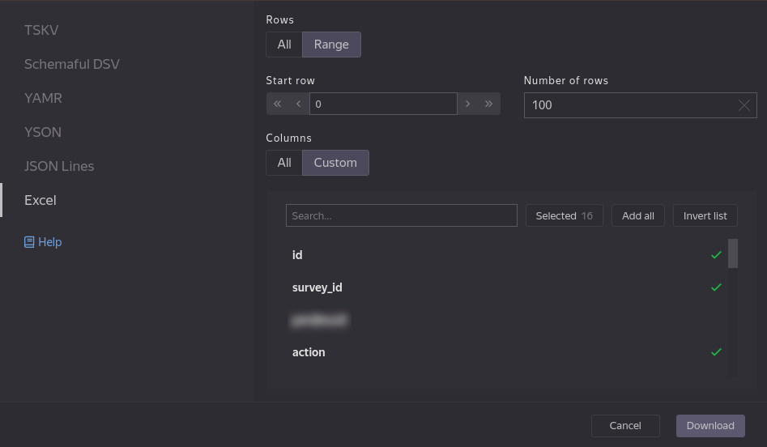

# Working with Excel

The {{product-name}} web interface helps load small Microsoft Excel spreadsheets into static {{product-name}} tables as well as download data from strict-schema static tables as Microsoft Excel spreadsheets.

## Upload to new table

You can upload while creating a {{product-name}} table by using the **Create object** menu item on the directory page.

{ .center }

It is important to set the **Column names** and the **Types** switches to the correct values in the upload menu.

Enabled **Column names** is tantamount to columns having names in the first row of an Excel spreadsheet. If a spreadsheet does not have a header, Excel column names, such as A, B, C, and so on, will be used as column names in the {{product-name}} table.

Enabled **Types** means there will be a row containing types. The row with types must follow the row containing the column names, if any. Types are defined in the `type` format (see [type mapping](../../../user-guide/storage/excel.md#type-mapping)).



If no types are specified, all columns will use `any` as their type.



{ .center }

## Uploading into an existing table

Upload into an existing {{product-name}} table is available by using the **Upload** button on the table page.

{ .center }



The Excel spreadsheet must include columns from the {{product-name}} table schema.
Additional columns in the Excel spreadsheet will be ignored.



You can select an upload mode in the upload menu using the **Append** switch. The on state corresponds to rows being appended at the end of the {{product-name}} table, the off state means that the table will be overwritten.

{ .center }

## Upload limitations

* Only the first sheet of an Excel book is loaded.
* Maximum number of rows is 1,048,576.
* Maximum number of columns is 16,384.
* Maximum input file size is 50 MB.

## Downloading

The interface provides a way to specify the required row and column subset.

{ .center }

The first row of the output will contain column names while the second one their types.

### Limitations

* Strict-schema static tables.
* Maximum number of rows is `1,048,574`.
* Maximum number of columns is `16,384`.
* Maximum output file size is 50 MB.
* Maximum string length in a cell is `32,767`. Strings longer than `32,767` are truncated.

### {#type-mapping} type mapping

Microsoft Excel supports [4 data types](http://johnatten.com/2011/10/03/microsoft-excel-basics-part-ii-data-types-in-excel/): `Logical`, `Number`, `Text`, and `Error`.

| **{{product-name}} data type description** | **Representation in `type`** | **Representation in `type_v3`** | **Representation in Excel** |
|----------------|--------------------|-----------------------|---------------------|
| an integer belonging to the range `[-2^63, 2^63-1]` | `int64` | `int64` | `Number*` |
| an integer belonging to the range `[-2^31, 2^31-1]` | `int32` | `int32` | `Number` |
| an integer belonging to the range `[-2^15, 2^15-1]` | `int16` | `int16` | `Number` |
| an integer belonging to the range `[-2^7, 2^7-1]` | `int8` | `int8` | `Number` |
| an integer belonging to the range `[0, 2^64-1]` | `uint64` | `uint64` | `Number*` |
| an integer belonging to the range `[0, 2^32-1]` | `uint32` | `uint32` | `Number` |
| an integer belonging to the range `[0, 2^16-1]` | `uint16` | `uint16` | `Number` |
| an integer belonging to the range `[0, 2^8-1]` | `uint8` | `uint8` | `Number` |
| a 4-byte real number | `float` | `float` | `Number*` |
| an 8-byte real number | `double` | `double` | `Number*` |
| Standard `true/false` boolean | `boolean` | `bool` (different from `type`) | `Logical` |
| Random byte sequence | `string` | `string` | `Text*` |
| a proper UTF8 sequence | `utf8` | `utf8` | `Text*` |
| an integer in the range `[0, 49673 - 1]`,   represents the number of days from the Unix epoch;   represented data range: `[1970-01-01, 2105-12-31]` | `date` | `date` | `Number**` |
| an integer in the range `[0, 49673 * 86400 - 1]`,   represents the number of seconds since the Unix epoch;   represented time interval: `[1970-01-01T00:00:00Z, 2105-12-31T23:59:59Z]` | `datetime` | `datetime` | `Number**` |
| an integer in the range `[0, 49673 * 86400 * 10^6 - 1]`,   represents the number of microseconds since the Unix epoch;   represented time interval:  `[1970-01-01T00:00:00Z, 2105-12-31T23:59:59.999999Z]` | `timestamp` | `timestamp` | `Number***` |
| an integer in the range  `[- 49673 * 86400 * 10^6 + 1, 49673 * 86400 * 10^6 - 1]`,  represents the number of microseconds between two timestamps | `interval` | `interval` | `Number*` |
| a random YSON structure,   physically represented by a byte sequence,   cannot have `required=%true` | `any` | `yson` (different from `type`) | `Text**` |

#### \*`Number*` {#Number*}

`Number` — это Double-Precision Floating Point value.

The number can only have [15 digits](https://stackoverflow.com/questions/38522197/converting-the-text-data-to-a-int64-format-in-excel),
and if an attempt is made to insert `99999999999999999` (`10^17-1`), the cell will contain `99999999999999900`.

Numbers that do not meet this constraint are exported as strings.

#### \*`Number**` {#Number**}

Values are inserted in `Number`. `date` and `datetime` are exported as `Number` represented in a special style,
and in Excel look as follows:
* `date` — `2020-12-05`
* `datetime` — `2000-12-10 10:22:17`

#### \*`Number***` {#Number***}

The value cannot fit in `Number`.
`Timestamp` in milliseconds is exported as `Number` represented in a special style (`1969-12-30 00:00:00`). For smaller units, it comes out as a string in the following format: `2006-01-02T15:04:05.999999Z`.

#### \*`Text*` {#Text*}

`Text` is a string type. Maximum strings length in a cell is `32,768`.

In {{product-name}}, a string may be longer: as long as `128 * 10^6`. Strings that are longer than this limit are truncated.

#### \*`Text**` {#Text**}

The values are serialized as [YSON](../../user-guide/storage/yson.md).
Long strings are truncated same as `Text*`.??

### Missing values

For missing values of type `optional`, an empty string will be inserted in the cell.
