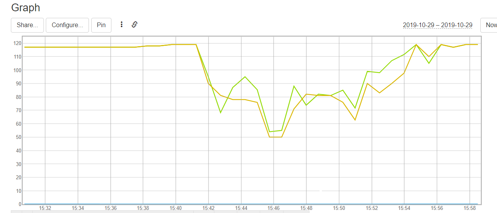

# Ресурсы и вытеснение

Клика CHYT является Vanilla-операцией {{product-name}}, а инстансы запускаются в джобах этой операции и потребляют ресурсы. Типичный инстанс CHYT запускается примерно на 10 ядрах CPU и около 60 ГБ оперативной памяти.

Перед чтением этой статьи рекомендуется ознакомьтесь со статьей [Планировщик и пулы](../../../../../user-guide/data-processing/scheduler/scheduler-and-pools.md).

## Вытеснение { #preemption }

Основнополагающий механизм обеспечения честности распределения ресурсов в планировщике {{product-name}} — вытеснение. Это означает, что если в какой-то момент операция начинает потерблять больше ресурсов, чем ей полагается, то любой ее джоб будет "вытесеснен", то есть принудительно остановлен, а на его месте будет запущен кто-то, кому на самом деле полагаются ресурсы. Такой джоб называется *aborted-джобом*, а причиной `abort` указывается `preemption`.

Для джобов обычных операций {{product-name}} такой подход работает хорошо, т.к. типичный джоб в {{product-name}} обладает продолжительностью в единицы минут, и потеря прогресса джоба не страшна — планировщик самостоятельно перезапустит джоб позже, когда под него найдутся ресурсы. Map-Reduce обладает задержками порядка минут, поэтому подобная ситуация абсолютно терпима.

В обстоятельствах CHYT всё несколько сложнее. Родной протокол ClickHouse не предусматривает механизма восстановления запросов, которые не выполнились из-за отказа какого-либо компонента во время исполнения. Это означает, что если на инстансе сейчас бегут запросы, а джобу, в котором запущен инстанс, прилетает `abort`, то все исполняющиеся запросы упадут с ошибкой сетевого уровня (`NetException`, `Attempt to read after eof`, `Connection refused` и другие). Клиенту к тому времени мог вернуться произвольный набор строк из ответа на запрос, что только усложняет задачу по перезапуску запроса.

## Interruption { #interruption }

В MR-джобах довольно давно используется механизм под названием *Interruption*: если {{product-name}} понимает, что скоро нужно прервать джоб, то он просто прекращает подавать джобу данные на вход. Если джоб успевает доработать за некоторый `interruption_timeout`, то считается `completed`, а недообработанные им данные будут поданы на вход какому-то другому новому джобу. Если же джоб не вписывается в `interruption_timeout`, то он просто абортится, а его вход будет полностью обработан другим джобом.

Инстансы ClickHouse не обрабатывают никакой вход обычным для {{product-name}} образом, самостоятельно исполняя запросы, приходящие из внешнего мира, поэтому информация о предстоящем interruption таким джобам приходит по-другому. Для CHYT поддерживается опция `interruption_signal` в спеке операции — сигнал, который будет послан джобу, чтобы уведомить его о скором завершении.

При получении сигнала инстанс переходит в режим завершения, рассылает с помощью gossip эту информацию остальным, и больше не принимает никаких новых запросов, но продолжает исполнять уже выполняющиеся. После исполнения всех текущих запросов инстанс завершится со статусом `completed`.

## Обычный preemption и graceful preemption { #preemption-dif }

В планировщике {{product-name}} заложена следующая логика вытеснения джобов: если на ноде есть джобы, `fair-share_ratio` операции которых меньше чем `usage_ratio`, то данный джоб считается `preemptable`. Если у планировщика есть джоб страдающей операции, который можно запустить на ноде при условии вытеснения preemptable джобов, то он так и делает — вытесняет нужное количество preemtable джобов и планирует новые на их месте. В такой модели непозволительно ждать вытеснения джобов очень долго, поэтому стандартный `interruption_timeout` равняется всего 15 секундам.

Типичный сценарий использования CHYT — маленькие и средние запросы, которые выполняются от единиц секунд до нескольких минут; `interruption_timeout = 15 sec` часто оказывается меньше времени работы стандартного запроса, а это значит, что многие запросы, которые выполнялись на данном инстансе, завершатся ошибкой.

Для борьбы с вытеснением инстансов можно запускать клику в пуле с гарантиями, но не у всех пользователей есть гарантии. Кроме того, некоторые пользователи хотели чтобы клика не мешала другим операциям в пуле — была маленькой когда есть спрос на ресурсы в пуле, и раздувалась когда есть лишние ресурсы.

Для решения данной задачи был добавлен новый режим планирования операций — *Graceful Preemption*. Чтобы избежать проблемы вытеснения в данном режиме, вытеснение происходит заранее — если есть `preemptable` джобы, им посылается сигнал завершения независимо от того, есть ли кандидат на эти ресурсы. Таким образом, операция самостоятельно стремится к тому, что `usage_ratio = fair-share_ratio`, догоняя честное количество ресурсов, которое ей полагается в моменте. Благодаря этому можно повысить таймаут на вытеснение до 10 минут, так как никто не простаивает, ожидая освобождения ресурсов.

Ниже представлен пример изменения `usage_ratio` (оранжевый график) и `fair-share_ratio` (зеленый график) после старта операции с большим весом в том же пуле, что и клика.

{ .center }

Чтобы воспользоваься *Graceful Preemption*, следует указать в параметре `--spec {preemption_mode = graceful}`.
