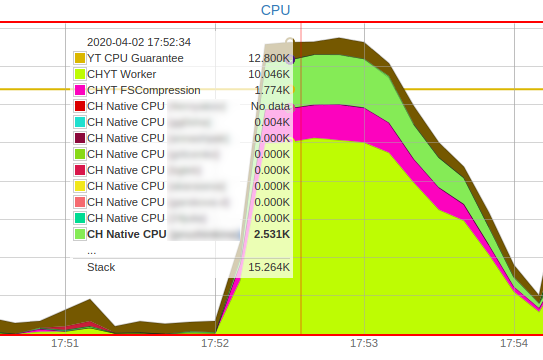

# Диагностика запросов

Перед чтением статьи следует ознакомиться со статьей [Анатомия запроса](../../../../../user-guide/data-processing/chyt/queries/anatomy.md).

<!-- и прочитать про [дашборд CHYT](../../../../../user-guide/data-processing/chyt//cliques/administration.md#dashboard)-->

В данной статье описано, как выяснить подробности про конкретный запрос — сколько данных он читал, был ли он CPU bound или IO bound и прочую полезную информацию.

## Потребление CPU во время исполнения запроса { #cpu-query }

График потребления CPU на во время того, как исполнялся запрос, наглядно демонстрирует, что было узким местом при исполнении запроса.

Перед прочтением этого раздела следует ознакомиться с [описанием графика CPU](../../../../../user-guide/data-processing/chyt/cliques/administration.md#cpu).

Примеры запросов приведены ниже. 

### Native CPU bound запрос

{ .center }

Данный запрос примерно на минуту загрузил клику по CPU до упора, причем почти всё потребление CPU ушло непосредственно на обработку данных в движке ClickHouse. 

CHYT FSCompression отсутствует почти полностью, что, скорее всего, означает, что данные полностью читались из block cache на инстансах.
**Спойлер**: на оригинальном графике, откуда был взят скриншот выше, перед этим запросом на самом деле видно цепочку запросов примерно того же вида от того же пользователя, что только подтверждает предположение.

CHYT Worker принимает небольшое значение, что означает, что "налог" на использование ClickHouse поверх не родного для него источника данных {{product-name}} почти не проявляется. 

Последние два показателя демонстрируют, что такой запрос является почти "идеальным" для CHYT — в нём почти не было накладных расходов. Ускорить такой запрос можно уменьшив объём обрабатываемых данных, либо увеличив размер клики — такой запрос должен линейно масштабироваться с ростом числа доступных ядер.

### Cильно фильтрующий IO bound запрос

{ .center }

Данный запрос выглядит принципиально по-другому, можно сделать два вывода.

Во-первых, видно, что данный запрос не смог прогрузить CPU по максимуму — суммарное потребление CPU составляет в среднем всего около 40 ядер, тогда как клике всего доступно 128 ядер. Это означает, что запрос преимущественно IO bound, и его можно пытаться ускорять, перекладывая данные на более быстрый носитель, такой как SSD.

Во-вторых у данного запроса почти весь CPU ушел на "CHYT Worker" (около 30 ядер в среднем), тогда как нативный код CH простаивал, нагружая только одно-два ядра суммарно по всем инстансам — это означает, что CHYT подготовил для CH очень много данных, которые CH потом практически не использовал. Такая ситуация частая для сильно фильтрующих запросов по узким колонкам, например:

`SELECT (lots of columns) FROM "//path/to/table" WHERE id == 42`

Такой запрос вынужден поднять с диска много данных включая все колонки из списка запрошенных, но при этом большая часть данных будет попросту выкинута, поскольку условие "id == 42" оставляет очень мало строк. Оптимизировать такой запрос можно с использованием конструкции PREWHERE языка SQL ClickHouse, переписав запрос как:

`SELECT (lots of columns) FROM "//path/to/table" PREWHERE id == 42`

Такому запросу тоже может помочь увеличение размера клики.

### CHYT Worker & IO bound запрос

{ .center }

Данный запрос был безусловно не IO-bound, он полностью прогрузил клику по CPU. Можно даже сказать больше — видно, что в пике клика потребляла чуть больше 150 ядер, тогда как она была сконфигурирована на 128 ядер. Это нормальная ситуация, так как если на какой-то ноде {{product-name}} розданы не все ядра под исполняющиеся на ней джобы, излишек ядер делится между населяющими её джобами пропорционально. Таким образом, в этот момент часть инстансов находилась на пустующих нодах, и запросу повезло утилизировать больше ресурсов, чем полагается клике. Это обстоятельство является приятной особенностью использования CHYT.

Также на этом графике видно, что около 17 ядер ушло на декомпрессию данных, вероятно обрабатываеме таблицы были сжаты довольно сильным кодеком.

Наконец, видно, что остальная часть CPU ушла на "CHYT Worker" и на нативный код CH в пропорции примерно 4:1. Это может означать одно из двух.

- Данный запрос, как и предыдущий, отсеивает довольно много строк, глядя на малую долю подготовленных CHYT данных.
- Для данного запроса оказался очень высоким "налог" от использования CH поверх {{product-name}}, и действительно большое время уходит на подготовку данных для CH.

Команда CHYT работает над эффективностью в этом месте и над уменьшением числа ситуаций, когда запросы большую часть времени проводят над накладными вычислениями, "излишне" грея CPU.

### DataLens Burst

{ .center }

Такая картина типична для клик, находящихся под дешбордами DataLens. Короткие всплески в 11:34, 11:40, 11:44, 11:46 и 12:18 и 12:23 показывают, как выглядит одиночное открытие дешборда, живущего поверх этой клики. Всё работает не мгновенно, но терпимо — типичное время открытия дешборда составляет порядка минуты, потому что запросы переваривают существенные объёмы данных.

Дальше в 11:47 случается неприятность и клика начинает захлёбываться. Вероятнее всего, дешборд открыло несколько человек одновременно либо кто-то активно начал нажимать F5. В такой ситуации клика начинает исполнять несколько копий одних и тех же запрсов, они в равной пропорции получают только долю CPU, и CPU bound запрос, который в обычное время бежит порядка минуты, начинает бежать десяток минут. Можно видеть, что число одновременно исполняемых подзапросов в пике достигало аж 400.  

Это приводит к положительной обратной связи — люди видят, что дешборд тормозит дольше, чем они привыкли, и дальше ситуация только усугубляется. В конце концов где-то около 12:00 раздосадованный пользователь прекращает пытаться добиться чего-либо от дешборда, отправляется изливать свое недовольство в чат поддержки, а нагрузка на клику потихоньку рассасывается, после чего всё возвращается в норму.

Что же делать в такой ситуации:

- Во-первых, можно пытаться делать клику более мощной, увеличивая число доступного CPU. Чем быстрее бежит отдельный запрос на ненагруженной клике, тем меньше вероятность оказаться в такой ситуации.

- Во-вторых, можно пересмотреть подход к формированию графиков. DataLens в качестве средства BI поверх данных в {{product-name}} хорош, когда для построения нужных ему величин нужно обработать небольшие объемы данных за считанные секунды. Если график требует для построения сканирования сотни ГБ, это верный повод задуматься — может быть, стоит на основе 100 ГБ построить препарат малого размера и крутить BI уже поверх него.
