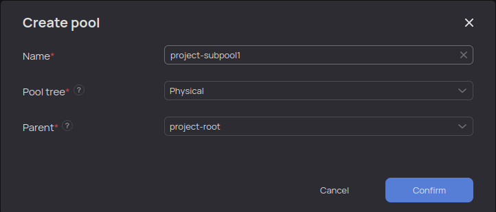
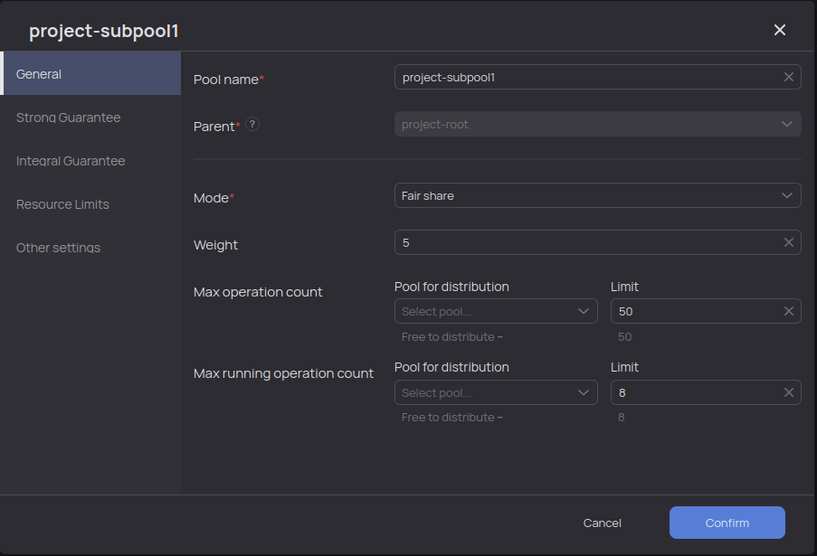

# Managing compute pools

This section explains how to create pools and manage resources and settings of compute pools in the {{product-name}} system using the CLI and web interface as examples.

## General information { #common }

The {{product-name}} system has a feature that manages compute pools and supports pool activities such as:

- Creating.
- Renaming.
- Moving.
- Deleting.
- Changing settings.

You can change the compute pool settings by editing the relevant pool attributes. Attributes that can be edited by the user:

* `weight`: Manages the share of the parent pool's resources that will go to the current pool.
* `max_operation_count`: A limit on the number of running (`running`) operations and operations in the queue (`pending`).
* `max_running_operation_count`: A limit on the number of running (`running`) operations.
* `strong_guarantee_resources`: A dict describing the pool's guaranteed resources.
* `forbid_immediate_operations`: Prohibits operations to be run directly in this pool.
* `mode`: A way of allocating resources between operations in the pool.
* `fifo_sort_parameters`: Managing the order in which operations are started in fifo pools.
* `resource_limits`: A dict that sets the upper limits for the resources available to the pool.
* `create_ephemeral_subpools`: Enables the creation of virtual pools.
* `ephemeral_subpool_config`: A dict describing the configuration of virtual pools.
* `integral-guarantees`: Integral guarantees.

For more information about the listed attributes, see [Pool characteristics](../../../../user-guide/data-processing/scheduler/pool-settings.md#pools).

### Validating

When validating, {{product-name}} checks attribute types, the `max_operation_count >= max_running_operation_count` limit, the number of tags in the `allowed_profiling_tags` list (no more than 200), consistency of resource guarantees, and whether there are subpools in fifo pools.

Consistency of resource guarantees means that for each resource, the sum of the descendants' guarantees must not exceed the parent's guarantee. If the subpool has a non-zero guarantee for a specific resource, it must also be set for the parent. The pool is allowed to have a non-zero guarantee on more than one resource.

## Managing pools via the CLI { #cli }

Creating a subpool:

```bash
yt create scheduler_pool --attributes='{pool_tree=physical;name=project-subpool1;parent_name=project-root}'
```

In the attributes, you can additionally pass the pool attributes and they will be validated. If the validation fails, the object will not be created.

Example of a weight change for the created pool:

```bash
yt set //sys/pool_trees/physical/project-root/project-subpool1/@weight 10
```

Initial setting of a pool guarantee provided that the parent has an unallocated guarantee:

```bash
yt set //sys/pool_trees/physical/project-root/project-subpool1/@min_share_resources '{cpu=50}'
```

A specific parameter can be changed to alter a set guarantee:

```bash
yt set //sys/pool_trees/physical/project-root/project-subpool1/@min_share_resources/cpu 100
```

Moving is performed in the standard way:

```bash
yt move //sys/pool_trees/physical/project-root/project-subpool1 //sys/pool_trees/new-project/new-subpool
```
Renaming via moving is supported.
Validation occurs when moving.

Attributes are set in the standard way:

```bash
yt set //sys/pool_trees/my_pool_tree/project_pool/@max_operation_count 10
```
Validation occurs when setting attributes.

## Managing pools via the web interface { #ui }

You can manage pools in the web interface in the `Scheduling` section.

To create a subpool, go to the parent pool by clicking its name. To do this, click `Create pool`, fill in all the required form fields, and click `Confirm`.

An example of a pool creation form is shown in the figure.




To edit the pool settings, click the pencil on the pool name line on the right-hand side of the screen as shown in the figure.


The pool settings available for editing are divided into groups. The figures show examples of general settings and guaranteed resources, respectively.




In the `Resource Limits` section, you can set an upper limit for the pool if, for example, you need the pool to remain within the 100-core consumption limit. By default, there is no upper limit for pools and the resources available to a pool are limited by the cluster capacity.

The `Other Settings` section provides additional settings, such as the prohibition to run operations in the pool.



Note that we recommend running operations precisely in the pool tree leaves, i.e. in those pools that have no subpools. In this case, it is useful to explicitly prohibit operations from running directly in this pool.

Operations must not be run in pool tree nodes (pools with subpools), otherwise it is more difficult to investigate various problems that occur when allocating resources between pools and operations.

