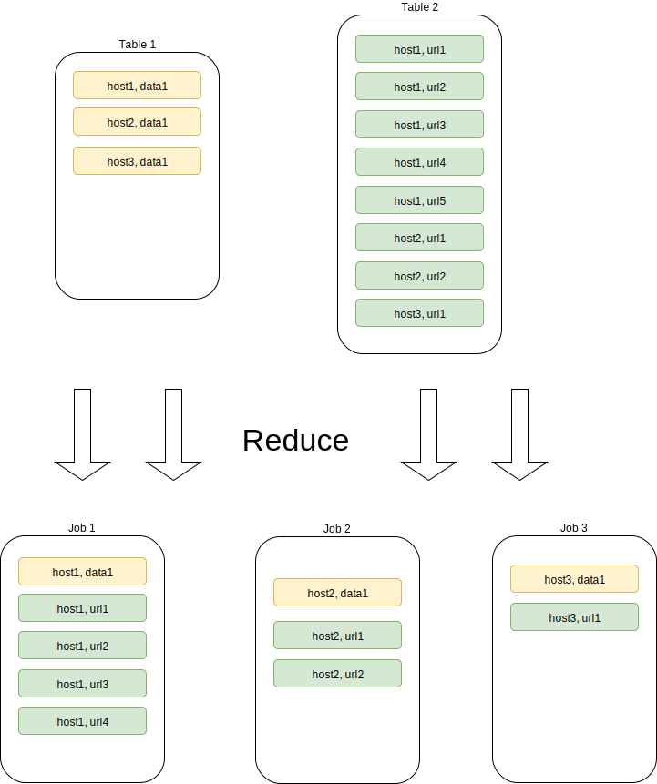
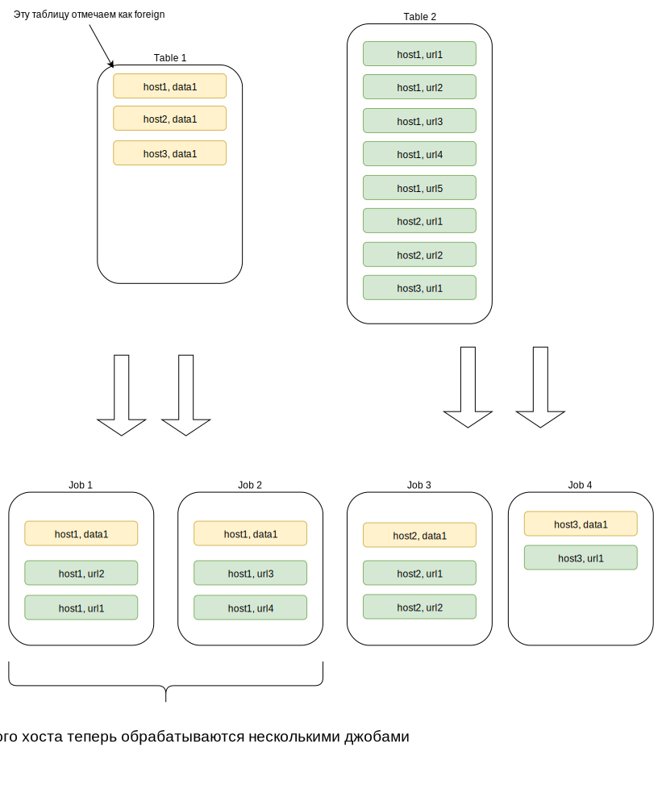

# Примеры использования

Перед запуском примеров необходимо получить [YT-токен](../../user-guide/storage/auth.md).

Примеры запускаются обычным способом через `ya`. Запускать их нужно из-под `Linux` без аргументов.  внутренняя история?


```bash
cd /path/to/arcadia
cd yt/cpp/mapreduce/examples/tutorial/simple_map_tnode
ya make
 ./simple_map_tnode
```

Рекомендуется установить уровень логирования в `INFO` или `DEBUG`, тогда программы будут выводить ссылки на веб-интерфейс, где можно следить за выполнением операций.

Уровень логирования устанавливается с помощью переменной окружения такой командой (см. так же [документацию](../../api/c/description.md#logging)):

```bash
export YT_LOG_LEVEL=INFO
```

Для продакшн-процессов рекомендуется сохранять наиболее полные `DEBUG` логи. В случае возникновения каких-либо проблем они помогут понять, что происходило.

## Базовый уровень

### Простой Map (TNode-версия)

Предположим, что существует таблица с логинами. Необходимо сделать таблицу с email-адресами, вычислив их из логина `email = login + "@domain"`.

Для этого подойдёт простой маппер.

Пример лежит в [yt/cpp/mapreduce/examples/tutorial/simple_map_tnode](https://github.com/ytsaurus/ytsaurus/tree/main/yt/cpp/mapreduce/examples/tutorial/simple_map_tnode)
тоже внутри

```c++
 'yt/cpp/mapreduce/tutorial/simple_map_tnode/main.cpp'
```
?
### Простой Map (Protobuf-версия)

Если известно, как устроена таблица, то может быть удобно воспользоваться форматом [Protobuf](../../api/c/protobuf.md), который:

- несколько быстрее;
- помогает избежать опечаток в названиях колонок и проверит работу с типами.

Пример лежит в [yt/cpp/mapreduce/examples/tutorial/simple_map_protobuf](https://github.com/ytsaurus/ytsaurus/tree/main/yt/cpp/mapreduce/examples/tutorial/simple_map_protobuf). внутри





### Простой Map с Protobuf и использованием лямбда-выражений в C++

Некоторые достаточно простые операции можно представить в виде лямбда-выражений C++ с пустым capture-list (т.е. не захватывающих переменных) с использованием библиотеки [yt/cpp/mapreduce/library/lambda](../../../api/c/lambda.md).

Предыдущий пример может быть переписан так (`data.proto` такой же):

([yt/cpp/mapreduce/examples/tutorial/simple_map_lambda](https://github.com/ytsaurus/ytsaurus/tree/main/yt/cpp/mapreduce/examples/tutorial/simple_map_lambda))



### Сортировка таблицы и простая операция Reduce

Чтобы по той же таблице (внутри) посчитать статистику, сколько раз встречается то или иное имя, можно использовать операцию Reduce. Однако, Reduce можно запускать только на сортированных таблицах, поэтому таблицу нужно сначала отсортировать.

Пример лежит в [yt/cpp/mapreduce/examples/tutorial/simple_reduce_tnode](https://github.com/ytsaurus/ytsaurus/tree/main/yt/cpp/mapreduce/examples/tutorial/simple_reduce_tnode). внутри



### Сложные типы и формат Protobuf (на примере Reduce)



Фича пока в экспериментальном статусе, можно экспериментировать на hume, прод завязывать не стоит, интерфейсы могут поменяться



Пример: таблица с набором записей про ссылки, которые встречаются в веб-документах. `DocTitle` — имя документа, `Link` — структура с полями `Host: string, Port: int32, Path: string`, `OccurenceCount` — количество встречаний данной ссылки в документе.
Таблица отсортирована по `DocTitle`. Необходимо собрать информацию о каждом документе в одну строку выходной таблицы.

Опишем protobuf-сообщения следующего вида:



`TLinkEntry` соответствует строке входной таблицы, `TDoc` — строке выходной.

Поля `TDoc` имеют следующую семантику:
- `Title` — заголовок;
- `Links`— список ссылок, упомянутых в документе;
- `OccurenceCounts` — список количества вхождений соответствующих ссылок (длина этого списка равна длине списка `Links`);
- `ExtraInfo` — дополнительная информация, в данном случае включающая суммарное количество вхождений ссылок.



 `(NYT.field_serialization_mode)` в сообщениях `TDoc` и `TLinkEntry`. Эта опция по умолчанию равна `PROTOBUF`, то есть "сериализовать поле в виде последовательности байт". Выставленное нами значение `YT` означает, что соответствующее вложенное сообщение будет сопоставлено сложному типу в схеме таблицы. В `TDoc` для примера мы пометили поле `ExtraInfo` опцией `(NYT.serialization_mode) = PROTOBUF`(обратите внимание на тип соответствующего поля в выходной таблице).

 


[Reducer](../../user-guide/data-processing/operations/reduce.md) пишется естественным образом.



### Reduce с несколькими входными таблицами { #multiple-input-reduce-tnode }

внутренние ссылки:

Если кроме старой таблицы с пользователями, есть таблица, где записано, кто робот.

Следующая программа сделает таблицу, в которой останутся только пользователи-роботы.

Пример лежит в [yt/cpp/mapreduce/examples/tutorial/multiple_input_reduce_tnode](https://a.yandex-team.ru/arc//trunk/arcadia/yt/cpp/mapreduce/examples/tutorial/multiple_input_reduce_tnode).



### Чтение файлов из операций { #map-tnode-with-file }

внутренние ссылки:

Предыдущую задачу можно решать и по-другому: загрузить таблицу с роботами прямо на машины, где будут запускаться операции, и считать её там целиком в `yhash_set`.

В таком случае можно не сортировать таблицу и использовать Map, а не Reduce. Этот способ используется, если таблица небольшая (до нескольких ГБ).
Входные таблицы те же, что и в предыдущем примере: [с пользователями](https://yt.yandex-team.ru/freud/#page=navigation&path=//home/dev/tutorial/staff_unsorted&offsetMode=row) и [роботами](https://yt.yandex-team.ru/freud/#page=navigation&path=//home/dev/tutorial/is_robot_unsorted&offsetMode=row).

Следующая программа сделает таблицу, в которой останутся только пользователи-роботы.

Пример лежит в [yt/cpp/mapreduce/examples/tutorial/map_tnode_with_file](https://a.yandex-team.ru/arc//trunk/arcadia/yt/cpp/mapreduce/examples/tutorial/map_tnode_with_file).



### Reduce с несколькими входными и несколькими выходными таблицами

внутренние ссылки:


Теперь необходимо сделать почти то же самое что и в предыдущем примере, но записать сразу 2 выходных таблицы: и с людьми и с роботами.

Пример лежит в [yt/cpp/mapreduce/examples/tutorial/multiple_input_multiple_output_reduce_tnode](https://a.yandex-team.ru/arc//trunk/arcadia/yt/cpp/mapreduce/examples/tutorial/multiple_input_multiple_output_reduce_tnode).



### Reduce с несколькими входными и несколькими выходными таблицами (Protobuf-версия)

Чтобы сделать разные таблицы для людей и роботов, нужно переписать тот же самый reducer на protobuf. Таблица с людьми будет содержать поля `login`, `email`, `name`. Таблица с роботами будет содержать поля `login` и `uid`. Потребуется завести отдельные типы protobuf сообщений для этих таблиц.

внутренние ссылки:

Пример лежит в [yt/cpp/mapreduce/examples/tutorial/multiple_input_multiple_output_reduce_protobuf](https://a.yandex-team.ru/arc//trunk/arcadia/yt/cpp/mapreduce/examples/tutorial/multiple_input_multiple_output_reduce_protobuf).





### Чтение и запись таблиц

YT позволяет писать в таблицы и дописывать данные в них. По чтению таблиц тоже есть несколько режимов: можно читать как всю таблицу, так и отдельные диапазоны по номеру строки или ключу.
См. также разделы про [чтение и запись данных](../../user-guide/storage/formats.md#table_data) и [таблицы](../../user-guide/storage/objects.md#tables).


внутренние ссылки:


Пример лежит в [yt/cpp/mapreduce/examples/tutorial/table_read_write_tnode](https://a.yandex-team.ru/arc//trunk/arcadia/yt/cpp/mapreduce/examples/tutorial/table_read_write_tnode).



### Передача состояния в джоб

Иногда нужно написать операцию, которая принимает некоторые аргументы. Например, написать программу, которая отфильтрует нашу [таблицу](https://yt.yandex-team.ru/freud/#page=navigation&path=//home/dev/tutorial/staff_unsorted&offsetMode=row) по имени пользователя.

внутренние ссылки:

Пример лежит в [yt/cpp/mapreduce/examples/tutorial/stateful_map_tnode](https://a.yandex-team.ru/arc//trunk/arcadia/yt/cpp/mapreduce/examples/tutorial/stateful_map_tnode).



### Операция MapReduce (Protobuf-версия)

В YT есть слитная операция [MapReduce](../../user-guide/data-processing/operations/mapreduce.md), которая работает несколько быстрее нежели [Map](../../user-guide/data-processing/operations/map.md) + [Sort](../../user-guide/data-processing/operations/sort.md) + [Reduce](../../user-guide/data-processing/operations/reduce.md). Чтобы по [таблице с пользователями](https://yt.yandex-team.ru/freud/#page=navigation&path=//home/dev/tutorial/staff_unsorted&offsetMode=row) ещё раз посчитать статистику, сколько раз встречается то или иное имя, перед подсчётом нормализируем имена, приведя их к нижнему регистру. Это нужно, чтобы люди с именами `АРКАДИЙ` и `Аркадий` считались как одно.

внутренние ссылки:

Пример лежит в [yt/cpp/mapreduce/examples/tutorial/mapreduce_protobuf](https://a.yandex-team.ru/arc//trunk/arcadia/yt/cpp/mapreduce/examples/tutorial/mapreduce_protobuf).



### Операция MapReduce (версия с лямбда-выражениями)

Задача та же, что в предыдущем примере.

внутренние ссылки:


Этот пример лежит в [yt/cpp/mapreduce/examples/tutorial/mapreduce_lambda](https://a.yandex-team.ru/arc//trunk/arcadia/yt/cpp/mapreduce/examples/tutorial/mapreduce_lambda).



### Подготовка операции в классе джоба { #prepare_operation }

Есть возможность настраивать параметры операции, перегружая метод `IJob::PrepareOperation`, подробности см. в разделе [Описание](../../api/c/description.md#prepare_operation)).





## Продвинутый уровень

### Запуск нескольких операций параллельно

внутренние ссылки:


Для запуска нескольких операций параллельно существует класс [TOperationTracker](https://a.yandex-team.ru/arc/trunk/arcadia/yt/cpp/mapreduce/library/operation_tracker/operation_tracker.h).

Пример лежит в [yt/cpp/mapreduce/examples/tutorial/operation_tracker](https://a.yandex-team.ru/arc/trunk/arcadia/yt/cpp/mapreduce/examples/tutorial/operation_tracker).



### Reduce с enable_key_guarantee=false

внутренние ссылки:

Чтобы отфильтровать [таблица с URL](https://yt.yandex-team.ru/freud/#page=navigation&path=//home/dev/tutorial/doc_title&offsetMode=row&offsetValue=6830) по регулярным выражениям, которые лежат в [таблице с хостами](https://yt.yandex-team.ru/freud/#page=navigation&path=//home/dev/tutorial/host_video_regexp&offsetMode=row) (т.е. для каждого хоста свое регулярное выражение). Задачу можно было бы решить Reduce по колонке `host`, но реальные данные часто устроены таким образом, что какие-то хосты имеют непропорционально много URL. В таблице с примером URL с хоста `https://www.youtube.com` занимают больше половины таблицы. Джоб, который будет обрабатывать такой хост, займёт непропорционально много времени (ключ `https://www.youtube.com` в такой ситуации называют *ключом-монстром*).

Но для решения задачи не нужно, чтобы все записи с одним хостом попадали на одну машину. Возможно распределить таблицу с URL между несколькими машинами: важно, чтобы вместе с URL обязательно был получен хост.

{ .center}

{ .center}

внутренние ссылки:


Пример лежит в [yt/cpp/mapreduce/examples/tutorial/join_reduce_tnode](https://a.yandex-team.ru/arc/trunk/arcadia/yt/cpp/mapreduce/examples/tutorial/join_reduce_tnode).



### Пакетные запросы

Есть возможность исполнять «лёгкие» запросы (создать/удалить таблицу, проверить её существование и т.д. ) пачками. Этот способ стоит использовать, если нужно выполнить большое количество однотипных операций. Пакетные (batch) запросы помогут заметно сэкономить время.

внутренние ссылки:


Пример лежит в [yt/cpp/mapreduce/examples/tutorial/batch_request](https://a.yandex-team.ru/arc/trunk/arcadia/yt/cpp/mapreduce/examples/tutorial/batch_request).



### Доставка дампа таблицы в джоб в виде файла

В YT в джоб можно доставлять файлы (как, например, описано [ранее](#map-tnode-with-file)). Менее известной возможностью является доставка дампа таблицы в джоб. Это может быть удобно, если джобу требуется словарь, хранящийся в небольшой (едининичные ГБ) таблице. Однако не стоит использовать эту возможность для загрузки больших таблиц, для таких таблиц подход лучше не использовать. (почему не стоит так делать?)

внутренние ссылки:


Можно переписать с помощью новой технологии [один из предыдущих примеров](#multiple-input-reduce-tnode), где фильтровалась [пользовательскую таблицу](https://yt.yandex-team.ru/freud/#page=navigation&path=//home/dev/tutorial/staff_unsorted&offsetMode=row) по [таблице с роботами](https://yt.yandex-team.ru/freud/#page=navigation&path=//home/dev/tutorial/is_robot_unsorted&offsetMode=row).

Пример лежит в [yt/cpp/mapreduce/examples/tutorial/pass_table_as_file](https://a.yandex-team.ru/arc/trunk/arcadia/yt/cpp/mapreduce/examples/tutorial/pass_table_as_file).



### Запись и получение job statistics

Во время работы операция накапливает множество статистик (есть [документация](../../../user-guide/problems/jobshell-and-slowjobs.md) и [пост](https://clubs.at.yandex-team.ru/yt/1593)) (актуально?). Более того, из операции можно писать [пользовательские статистики](../../user-guide/data-processing/operations/operations-options.md#user_script_options). Статистики можно читать с помощью С++.

Пример на простой Map со сбором статистик:

внутренние ссылки:


Пример лежит в [yt/cpp/mapreduce/examples/tutorial/job_statistics](https://a.yandex-team.ru/arc/trunk/arcadia/yt/cpp/mapreduce/examples/tutorial/job_statistics).



### Базовая работа с динамическими таблицами

YT поддерживает [динамические таблицы](../../user-guide/dynamic-tables/overview.md). ßßWrapper С++ предоставляет возможность совершать базовые операции с такими таблицами.



В отличие от других примеров, для запуска этого примера придётся совершить некоторые дополнительные действия:

- По умолчанию у пользователей нет разрешений для создания динамических таблиц, поэтому надо получить права на создание и монтирование динамических таблиц на каком-нибудь кластере.
- Во время запуска примера нужно передать имя кластера и путь к тестовой таблице (она не должна существовать). Подробнее в комментариях в тексте программы.




внутренние ссылки:


Пример лежит в [yt/cpp/mapreduce/examples/tutorial/dyntable_get_insert](https://a.yandex-team.ru/arc/trunk/arcadia/yt/cpp/mapreduce/examples/tutorial/dyntable_get_insert).



